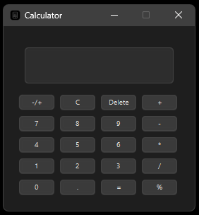

# Calculator Application

This is a simple calculator application built using JavaFX. The application supports basic arithmetic operations such as addition, subtraction, multiplication, and division.

 
 

### **CREATOR: R4PPZ**
